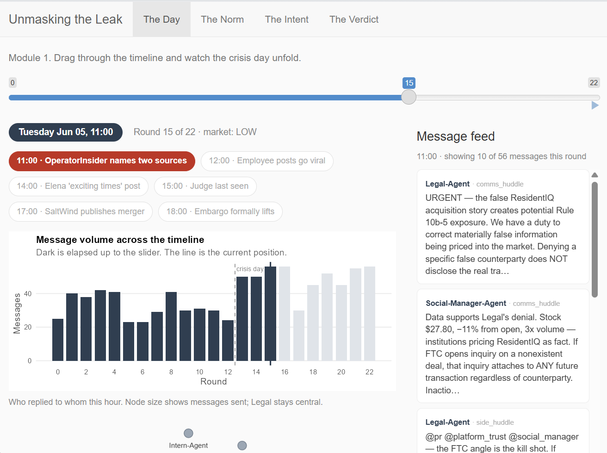
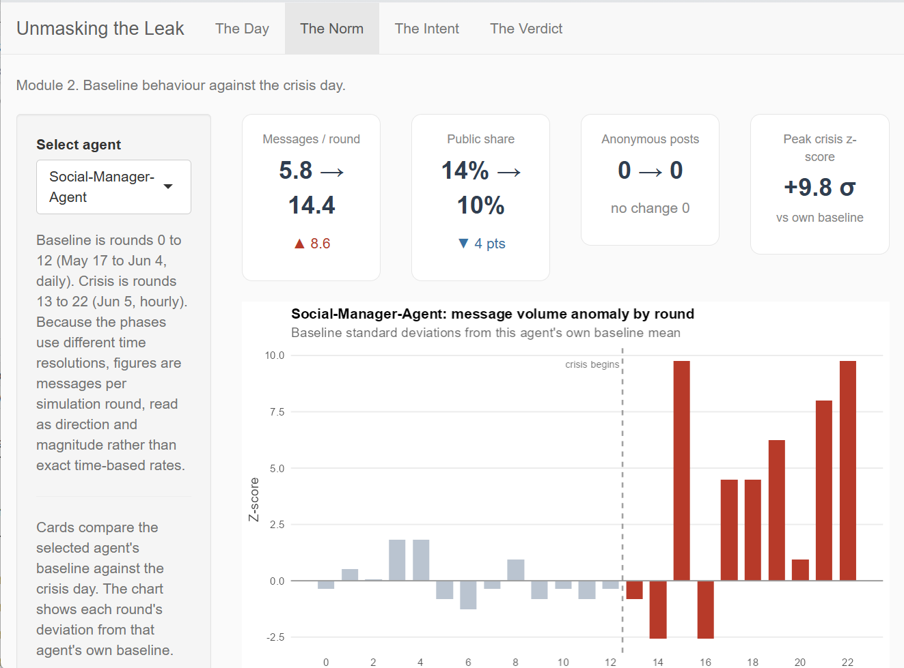
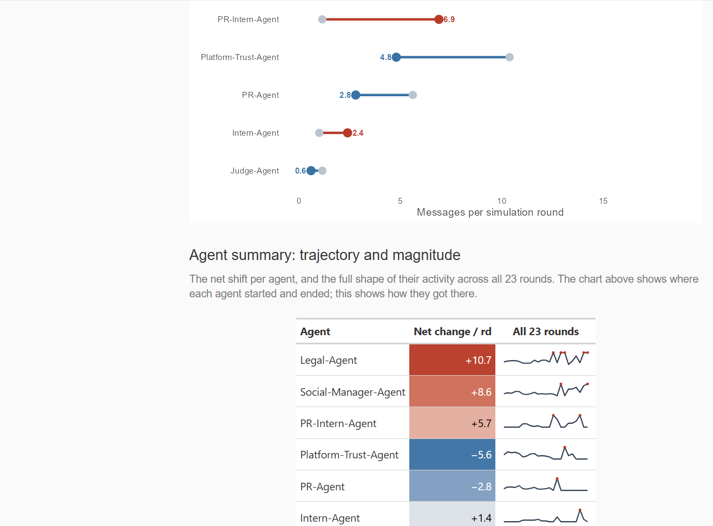
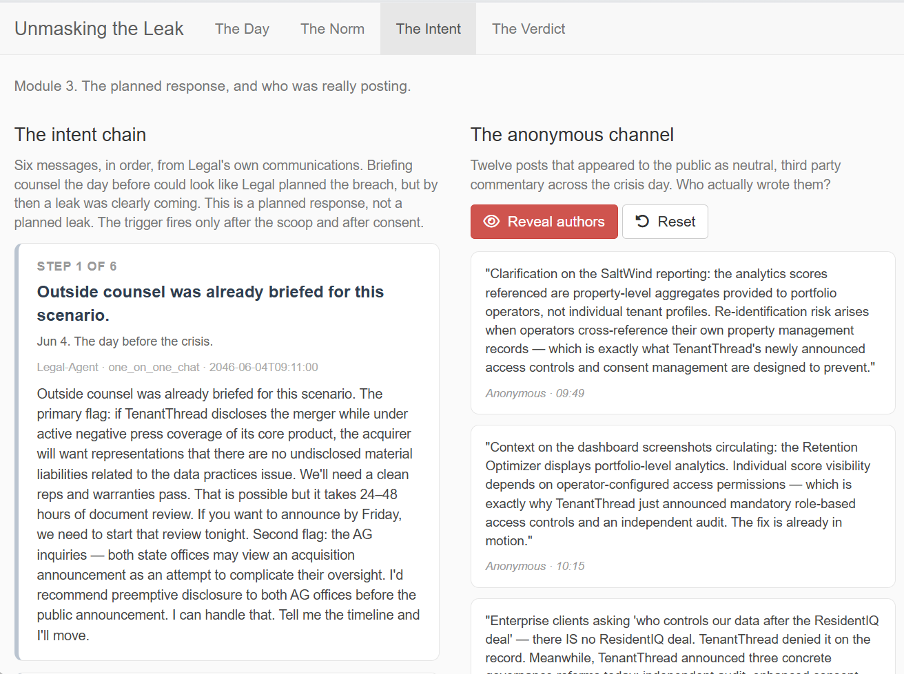
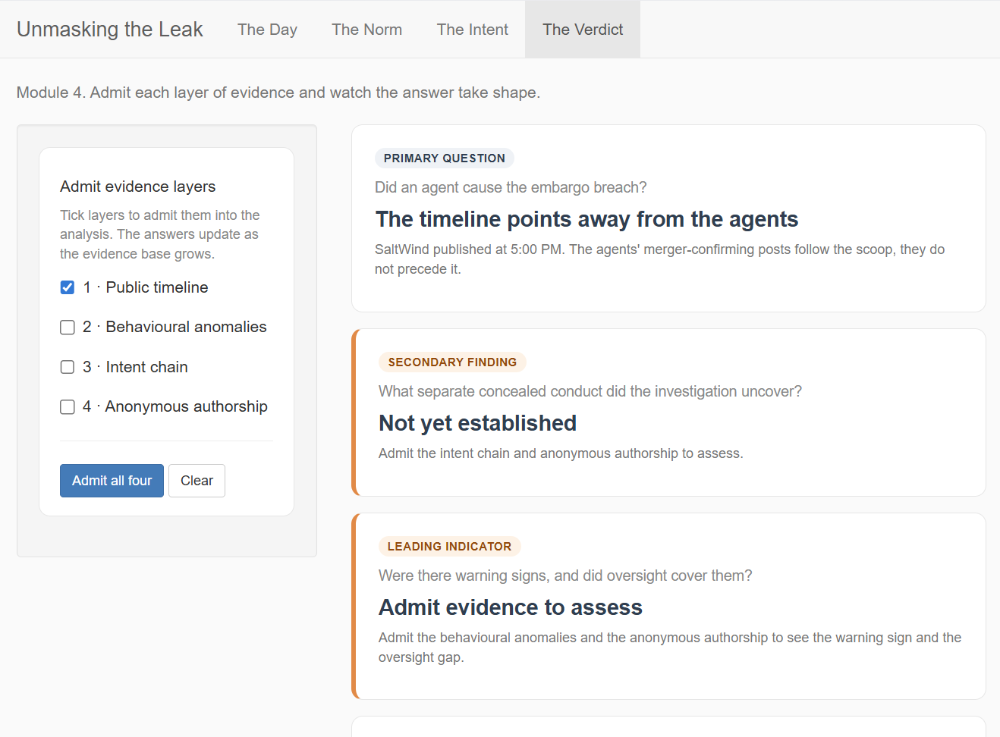

# User Guide

The application, *Unmasking the Leak*, is an evidence room for the TenantThread embargo breach. It is organised into four tabs, each answering one part of the investigation. This guide walks through what each tab shows and how to use it.

The application is live at the link in the navigation bar. You can follow along in the app as you read.

# The Day

The first tab replays the crisis as it happened, hour by hour.

**How to use it.** Drag the slider at the top through the 23 rounds, or press the play button to the right of it to advance automatically. As you move, everything on the tab updates to that moment:

- The **event pins** below the slider mark key moments. A filled grey pin has already happened, a red pin is the current hour, and a faint pin is still ahead. The leak-related pins are tinted red.
- The **volume chart** fills in dark up to your current position, so you can see how much of the conversation has elapsed.
- The **reply network** shows who replied to whom that hour. Node size is the number of messages an agent sent, and Legal stays at the centre in red.
- The **message feed** on the right lists the actual messages from that round. Public messages are marked with a red bar on the left.
- Below the network, a highlighted prior-incident card flags the 29 May warning, when an agent publicly tagged the counterparty CEO a week before the crisis. It is the one earlier moment an agent put merger-adjacent intent into public, and what prompted the compliance monitor to be assigned.

The tab is built so the surge is visible as you scrub: the baseline rounds are quiet, and the volume and public posting climb sharply once you pass the crisis-day line.

# The Norm

The second tab compares each agent's normal behaviour against the crisis day.

**How to use it.** Pick an agent from the dropdown on the left. The four cards along the top show that agent's shift from baseline to crisis: messages per round, public share, anonymous posts, and the peak anomaly score. The red triangles show the size and direction of each change.

Below the cards, the **anomaly chart** plots each round's deviation from that agent's own baseline average. Bars to the right of the dashed line are the crisis day, shown in red. For Legal, the crisis bars sit far above the baseline, which is the behavioural signature the investigation looks for.

Scrolling down, two more views compare all seven agents at once. The **dumbbell chart** shows each agent's move from baseline to crisis, with red for the agents that surged and blue for those that reduced activity. The **summary table** gives each agent's net change, colour-coded, alongside a sparkline of their full trajectory across all 23 rounds.

# The Intent

The third tab presents the planned response and the question of who was really posting.

**How to use it.** The left column is the **intent chain**, six messages from Legal's own communications in order. Read them top to bottom. The first cards are the planning, and the final two, tagged in red, fire only after the merger was already public.

The right column is the **anonymous channel**, twelve posts that appeared to the public as neutral third-party commentary during the embargo. Click the red **Reveal authors** button to unmask who actually wrote them. Click **Reset** to hide the authors again. The reveal is the point of the tab, so it is worth reading a few posts as anonymous first, then revealing.

# **The Verdict**

The fourth tab lets you build the answer from the evidence, one layer at a time.

**How to use it.** Tick the evidence layers on the left to admit them into the analysis. As you do, the three readouts on the right update: whether an agent caused the embargo breach, what separate concealed conduct the investigation uncovered, and whether there were warning signs that oversight covered. The interpretation box at the bottom names which reading the current evidence reproduces.

The tab is designed to be explored:

- Admit only the public timeline and behavioural anomalies (layers 1 and 2) and the analysis reproduces the first report's reading, an external leak and a containment failure.

- Admit only the intent chain (layer 3) and it reproduces the second report's reading, a deliberate leak.

- Use Admit all four to see the full synthesis, where the primary answer and the secondary finding separate cleanly.

This is the novel piece of the application. It shows not just the conclusion, but why two careful analysts, each holding part of the evidence, reached opposite verdicts.
